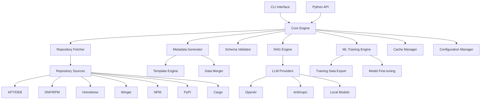

# Design Document

## Overview

The standalone saidata generator is a comprehensive Python package that automates the creation, validation, and management of software metadata in YAML format following the saidata-0.1.schema.json specification. The system is designed as a separate git repository and PyPI package, inspired by the existing saidata/bin scripts and documentation patterns.

The generator integrates traditional package repository scraping with modern AI capabilities including RAG (Retrieval-Augmented Generation) and model fine-tuning for enhanced metadata generation. It supports batch processing, multi-source data aggregation, and provides both CLI and programmatic interfaces.

## Architecture

### High-Level Architecture



### Component Architecture

The system follows a modular architecture with clear separation of concerns:

1. **Core Engine**: Central orchestrator managing all operations
2. **Repository Fetcher**: Handles data collection from package repositories
3. **Metadata Generator**: Creates saidata YAML files from collected data
4. **Schema Validator**: Validates generated files against saidata-0.1.schema.json
5. **RAG Engine**: Integrates with LLMs for enhanced metadata generation
6. **ML Training Engine**: Handles training data export and model fine-tuning
7. **Configuration Manager**: Manages settings and provider configurations
8. **Cache Manager**: Optimizes performance through intelligent caching

## Components and Interfaces

### Core Engine (`saidata_gen/core/engine.py`)

The central orchestrator that coordinates all operations and provides the main API.

```python
class SaidataEngine:
    def __init__(self, config_path: Optional[str] = None)
    def generate_metadata(self, software_name: str, options: GenerationOptions) -> MetadataResult
    def validate_metadata(self, file_path: str) -> ValidationResult
    def batch_process(self, software_list: List[str], options: BatchOptions) -> BatchResult
    def search_software(self, query: str) -> List[SoftwareMatch]
    def fetch_repository_data(self, providers: List[str]) -> FetchResult
```

### Repository Fetcher (`saidata_gen/fetcher/`)

Handles data collection from various package repositories, inspired by fetch_repodata.sh.

```python
class RepositoryFetcher:
    def __init__(self, config: FetcherConfig)
    def fetch_all_repositories(self) -> Dict[str, RepositoryData]
    def fetch_repository(self, provider: str) -> RepositoryData
    def search_package(self, name: str, providers: List[str]) -> List[PackageInfo]
    def get_package_details(self, name: str, provider: str) -> Optional[PackageDetails]
```

#### Repository Source Implementations

- **APTSource**: Fetches Debian/Ubuntu package data from Packages.gz files
- **DNFSource**: Processes RPM repository metadata from repomd.xml and primary.xml
- **BrewSource**: Integrates with Homebrew JSON API for formulae and casks
- **WingetSource**: Clones and processes winget-pkgs YAML manifests
- **NPMSource**: Queries npm registry API for JavaScript packages
- **PyPISource**: Fetches Python package metadata from PyPI API
- **CargoSource**: Processes Rust crate data from crates.io API and index

### Metadata Generator (`saidata_gen/generator/`)

Creates saidata YAML files following the schema and default patterns.

```python
class MetadataGenerator:
    def __init__(self, template_engine: TemplateEngine, schema_path: str)
    def generate_from_sources(self, software_name: str, sources: List[PackageInfo]) -> SaidataMetadata
    def apply_defaults(self, metadata: dict) -> dict
    def merge_provider_data(self, base: dict, provider_data: Dict[str, dict]) -> dict
    def enhance_with_rag(self, metadata: dict, rag_engine: RAGEngine) -> dict
```

### Schema Validator (`saidata_gen/validation/`)

Validates generated YAML files against the saidata-0.1.schema.json specification.

```python
class SchemaValidator:
    def __init__(self, schema_path: str)
    def validate_file(self, file_path: str) -> ValidationResult
    def validate_data(self, data: dict) -> ValidationResult
    def validate_batch(self, file_paths: List[str]) -> BatchValidationResult
    def get_schema_info(self) -> SchemaInfo
```

### RAG Engine (`saidata_gen/rag/`)

Integrates with Large Language Models for enhanced metadata generation.

```python
class RAGEngine:
    def __init__(self, config: RAGConfig)
    def enhance_description(self, software_name: str, basic_info: dict) -> str
    def categorize_software(self, software_info: dict) -> CategoryInfo
    def fill_missing_fields(self, metadata: dict) -> dict
    def generate_confidence_scores(self, metadata: dict) -> Dict[str, float]
```

#### LLM Provider Implementations

- **OpenAIProvider**: Integrates with OpenAI GPT models
- **AnthropicProvider**: Supports Claude models
- **LocalModelProvider**: Supports local models via Ollama or similar

### ML Training Engine (`saidata_gen/ml/`)

Handles training data export and model fine-tuning capabilities.

```python
class MLTrainingEngine:
    def __init__(self, config: MLConfig)
    def export_training_data(self, format: str, output_path: str) -> ExportResult
    def create_instruction_dataset(self, samples: List[dict]) -> InstructionDataset
    def fine_tune_model(self, dataset_path: str, model_config: ModelConfig) -> FineTuningResult
    def evaluate_model(self, model_path: str, test_data: str) -> EvaluationResult
```

## Data Models

### Core Data Models

```python
@dataclass
class SaidataMetadata:
    version: str = "0.1"
    packages: Dict[str, PackageConfig] = field(default_factory=dict)
    services: Dict[str, ServiceConfig] = field(default_factory=dict)
    directories: Dict[str, DirectoryConfig] = field(default_factory=dict)
    processes: Dict[str, ProcessConfig] = field(default_factory=dict)
    ports: Dict[str, PortConfig] = field(default_factory=dict)
    containers: Dict[str, ContainerConfig] = field(default_factory=dict)
    charts: Dict[str, dict] = field(default_factory=dict)
    repos: Dict[str, dict] = field(default_factory=dict)
    urls: URLConfig = field(default_factory=URLConfig)
    language: Optional[str] = None
    description: Optional[str] = None
    category: CategoryConfig = field(default_factory=CategoryConfig)
    license: Optional[str] = None
    platforms: List[str] = field(default_factory=list)

@dataclass
class PackageConfig:
    name: Optional[str] = None
    version: Optional[str] = None
    install_options: Optional[str] = None

@dataclass
class URLConfig:
    website: Optional[str] = None
    sbom: Optional[str] = None
    issues: Optional[str] = None
    documentation: Optional[str] = None
    support: Optional[str] = None
    source: Optional[str] = None
    license: Optional[str] = None
    changelog: Optional[str] = None
    download: Optional[str] = None
    icon: Optional[str] = None

@dataclass
class CategoryConfig:
    default: Optional[str] = None
    sub: Optional[str] = None
    tags: Optional[List[str]] = None
```

### Configuration Models

```python
@dataclass
class GenerationOptions:
    providers: List[str] = field(default_factory=list)
    use_rag: bool = False
    rag_provider: str = "openai"
    include_dev_packages: bool = False
    confidence_threshold: float = 0.7
    output_format: str = "yaml"
    validate_schema: bool = True

@dataclass
class RAGConfig:
    provider: str = "openai"
    model: str = "gpt-3.5-turbo"
    api_key: Optional[str] = None
    base_url: Optional[str] = None
    temperature: float = 0.1
    max_tokens: int = 1000

@dataclass
class FetcherConfig:
    cache_dir: str = "~/.saidata-gen/cache"
    cache_ttl: int = 3600
    concurrent_requests: int = 5
    request_timeout: int = 30
    retry_count: int = 3
```

## Error Handling

### Error Hierarchy

```python
class SaidataGenError(Exception):
    """Base exception for saidata-gen operations"""

class ValidationError(SaidataGenError):
    """Raised when schema validation fails"""

class FetchError(SaidataGenError):
    """Raised when repository fetching fails"""

class GenerationError(SaidataGenError):
    """Raised when metadata generation fails"""

class RAGError(SaidataGenError):
    """Raised when RAG operations fail"""

class ConfigurationError(SaidataGenError):
    """Raised when configuration is invalid"""
```

### Error Recovery Strategies

1. **Graceful Degradation**: Continue with available data sources when some fail
2. **Fallback Sources**: Automatically try alternative repositories
3. **Partial Results**: Return partial metadata with confidence indicators
4. **Retry Logic**: Implement exponential backoff for transient failures
5. **User Guidance**: Provide actionable error messages and suggestions

## Testing Strategy

### Unit Testing

- **Component Isolation**: Test each component independently with mocks
- **Repository Testing**: Mock external APIs and services
- **Schema Validation**: Test with valid/invalid YAML data
- **RAG Testing**: Mock LLM responses for consistent testing

### Integration Testing

- **End-to-End Workflows**: Test complete metadata generation flows
- **Multi-Source Integration**: Verify data aggregation from multiple repositories
- **RAG Integration**: Test LLM integration with real and mocked responses
- **CLI Integration**: Verify command-line interface functionality

### Performance Testing

- **Batch Processing**: Test performance with large software lists
- **Concurrent Operations**: Verify thread safety and concurrent access
- **Memory Usage**: Monitor memory consumption during large operations
- **Cache Effectiveness**: Measure cache hit rates and performance impact

## Performance Considerations

### Caching Strategy

```python
class CacheManager:
    def __init__(self, cache_dir: str, ttl: int = 3600)
    def get_cached_data(self, key: str) -> Optional[dict]
    def cache_data(self, key: str, data: dict) -> None
    def invalidate_cache(self, pattern: str) -> None
    def cleanup_expired(self) -> None
```

### Optimization Techniques

1. **Lazy Loading**: Load repository data only when needed
2. **Parallel Processing**: Process multiple packages concurrently
3. **Request Batching**: Batch API requests where possible
4. **Smart Caching**: Cache at multiple levels (metadata, API responses, web content)
5. **Connection Pooling**: Reuse HTTP connections for API calls

## Security Considerations

### Data Protection

- **API Key Management**: Secure storage of LLM provider API keys
- **Input Validation**: Sanitize all user inputs to prevent injection attacks
- **URL Validation**: Verify URLs before making requests
- **Content Filtering**: Filter potentially malicious content from scraped data

### Network Security

- **HTTPS Enforcement**: Use secure connections for all external requests
- **Certificate Validation**: Verify SSL certificates for external services
- **Rate Limiting**: Respect API limits and avoid overwhelming services
- **Timeout Controls**: Prevent hanging connections and resource exhaustion

## Deployment and Configuration

### Package Structure

```
saidata-gen/
├── saidata_gen/
│   ├── __init__.py
│   ├── cli/
│   │   ├── __init__.py
│   │   └── main.py
│   ├── core/
│   │   ├── __init__.py
│   │   └── engine.py
│   ├── fetcher/
│   │   ├── __init__.py
│   │   ├── base.py
│   │   ├── apt.py
│   │   ├── dnf.py
│   │   ├── brew.py
│   │   └── ...
│   ├── generator/
│   │   ├── __init__.py
│   │   ├── core.py
│   │   └── templates.py
│   ├── validation/
│   │   ├── __init__.py
│   │   └── schema.py
│   ├── rag/
│   │   ├── __init__.py
│   │   ├── engine.py
│   │   └── providers/
│   ├── ml/
│   │   ├── __init__.py
│   │   ├── training.py
│   │   └── export.py
│   └── utils/
│       ├── __init__.py
│       ├── cache.py
│       └── config.py
├── tests/
├── docs/
├── examples/
├── schemas/
│   └── saidata-0.1.schema.json
├── templates/
│   └── defaults.yaml
├── pyproject.toml
├── README.md
└── LICENSE
```

### Configuration Management

The system uses a hierarchical configuration approach:

1. **Default Configuration**: Built-in defaults for all settings
2. **System Configuration**: System-wide settings in `/etc/saidata-gen/`
3. **User Configuration**: User-specific settings in `~/.saidata-gen/`
4. **Project Configuration**: Project-specific settings in `.saidata-gen/`
5. **Environment Variables**: Override any setting via environment variables

### Installation Options

- **PyPI Package**: Standard pip installation (`pip install saidata-gen`)
- **Development Installation**: Editable installation for development
- **Docker Container**: Containerized deployment option
- **Standalone Binary**: Self-contained executable using PyInstaller

## RAG Integration Details

### Vector Database Integration

The RAG system uses vector embeddings to enhance metadata generation:

```python
class VectorStore:
    def __init__(self, provider: str = "chromadb")
    def add_documents(self, documents: List[Document]) -> None
    def search_similar(self, query: str, k: int = 5) -> List[Document]
    def update_embeddings(self, documents: List[Document]) -> None
```

### Training Data Generation

The system can generate training datasets for model fine-tuning:

```python
class TrainingDataGenerator:
    def create_instruction_pairs(self, metadata_samples: List[dict]) -> List[InstructionPair]
    def augment_data(self, base_samples: List[dict]) -> List[dict]
    def export_dataset(self, format: str, output_path: str) -> None
```

## CLI Interface Design

The command-line interface provides comprehensive functionality:

```bash
# Generate metadata for a single software
saidata-gen generate nginx

# Generate with specific providers
saidata-gen generate nginx --providers apt,brew,docker

# Batch processing
saidata-gen batch --input software_list.txt --output ./generated/

# Search for software
saidata-gen search "web server"

# Validate generated files
saidata-gen validate nginx.yaml

# Fetch repository data
saidata-gen fetch --providers apt,brew --cache-dir ./cache/

# AI-enhanced generation
saidata-gen generate nginx --ai --ai-provider openai

# Export training data
saidata-gen ml export-training-data --format jsonl --output training.jsonl

# Fine-tune model
saidata-gen ml fine-tune --dataset training.jsonl --model-config config.yaml
```